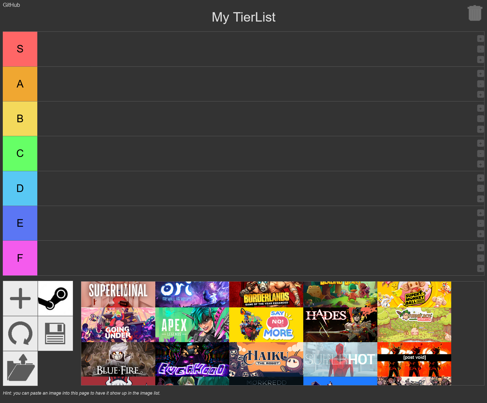

# Offline Tierlist Maker with Steam Implementation

A simple implementation of [Tierlists](https://github.com/silverweed/tiers) for fetching owned Steam games.


## Prerequisites

- Node.js

## How to Use

1. Edit `API_KEY` and `STEAM_ID` in `server.js`.

   - To get Steam's API key, visit [Steam API Key](https://steamcommunity.com/dev/apikey).
   - To find your Steam ID, visit [Steam ID Finder](https://www.steamidfinder.com/) and retrieve the `steamID64 (Dec)`.

2. Install [Node.js](https://nodejs.org/en/download/prebuilt-binaries).

3. Run the following command in the current directory:

   ```sh
   node server.js
   ```
4. Go to `http://localhost:3000`

5. Press the Steam icon and Done
